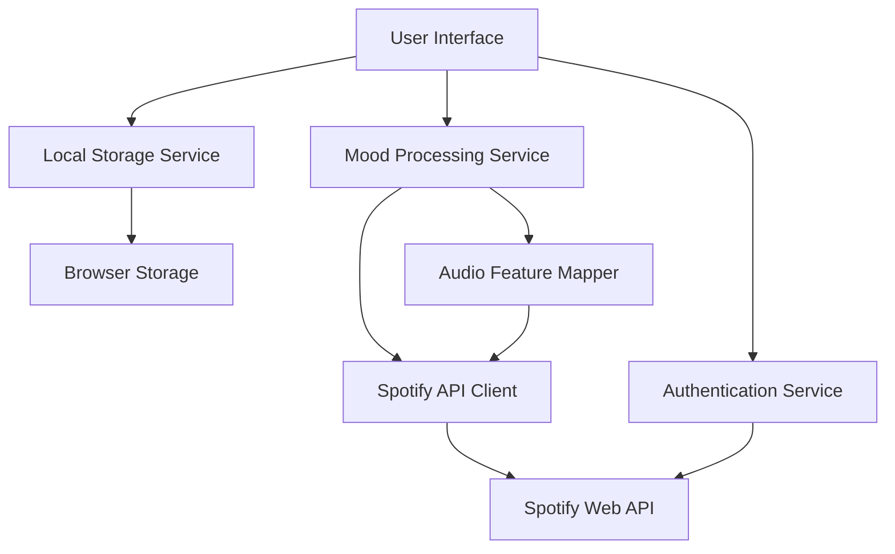

# Design Document

## Overview

The mood-based music recommendation system will integrate with the Spotify Web API to provide personalized music suggestions based on user emotional states. The application will be built as a Next.js web application with a React frontend, leveraging Spotify's OAuth 2.0 authentication and recommendation algorithms enhanced by audio feature analysis.

The system will map user mood inputs to Spotify's audio features (valence, energy, danceability, acousticness) to find music that matches emotional states. The application will maintain a clean, intuitive interface while providing robust error handling and user session management.

## Architecture

### High-Level Architecture



### Component Structure

- **Frontend Layer**: Next.js React components with Tailwind CSS styling
- **Service Layer**: API clients, authentication handlers, and business logic
- **Data Layer**: Local storage for user preferences and recommendation history
- **External Integration**: Spotify Web API for music data and authentication

### Technology Stack

- **Frontend**: Next.js 14+ with React 18+, Tailwind CSS
- **Authentication**: Spotify OAuth 2.0 with PKCE flow
- **State Management**: React hooks and context for global state
- **HTTP Client**: Fetch API with custom wrapper for Spotify endpoints
- **Storage**: Browser localStorage for user data and session management
- **Deployment**: Vercel or similar platform supporting Next.js

## Components and Interfaces

### Core Components

#### 1. MoodInput Component
```typescript
interface MoodInputProps {
  onMoodSubmit: (mood: string) => void;
  isLoading: boolean;
}
```
- Handles user mood input with autocomplete suggestions
- Validates input and provides real-time feedback
- Integrates with existing search interface

#### 2. RecommendationDisplay Component
```typescript
interface RecommendationDisplayProps {
  albums: SpotifyAlbum[];
  tracks: SpotifyTrack[];
  mood: string;
  onItemClick: (item: SpotifyAlbum | SpotifyTrack) => void;
}
```
- Displays album and track recommendations in grid layout
- Shows artwork, metadata, and mood relevance indicators
- Handles user interactions for playback and details

#### 3. AuthenticationProvider Component
```typescript
interface AuthContextType {
  isAuthenticated: boolean;
  accessToken: string | null;
  login: () => void;
  logout: () => void;
  refreshToken: () => Promise<void>;
}
```
- Manages Spotify OAuth flow and token lifecycle
- Provides authentication context to child components
- Handles token refresh and error states

#### 4. HistoryViewer Component
```typescript
interface HistoryViewerProps {
  history: MoodSearchHistory[];
  onHistoryItemClick: (item: MoodSearchHistory) => void;
}
```
- Displays previous mood searches and recommendations
- Allows users to revisit past discoveries
- Manages local storage interactions

### Service Interfaces

#### SpotifyApiClient
```typescript
interface SpotifyApiClient {
  searchTracks(query: string, audioFeatures: AudioFeatures): Promise<SpotifyTrack[]>;
  searchAlbums(query: string, audioFeatures: AudioFeatures): Promise<SpotifyAlbum[]>;
  getRecommendations(seedTracks: string[], audioFeatures: AudioFeatures): Promise<SpotifyTrack[]>;
  getAudioFeatures(trackIds: string[]): Promise<AudioFeatures[]>;
}
```

#### MoodMapper
```typescript
interface MoodMapper {
  mapMoodToAudioFeatures(mood: string): AudioFeatures;
  analyzeMoodSentiment(mood: string): MoodAnalysis;
}
```

## Data Models

### Core Data Types

```typescript
interface SpotifyTrack {
  id: string;
  name: string;
  artists: SpotifyArtist[];
  album: SpotifyAlbum;
  duration_ms: number;
  preview_url: string | null;
  external_urls: {
    spotify: string;
  };
}

interface SpotifyAlbum {
  id: string;
  name: string;
  artists: SpotifyArtist[];
  images: SpotifyImage[];
  release_date: string;
  total_tracks: number;
  external_urls: {
    spotify: string;
  };
}

interface SpotifyArtist {
  id: string;
  name: string;
  external_urls: {
    spotify: string;
  };
}

interface AudioFeatures {
  valence: number;        // 0.0 - 1.0 (sad to happy)
  energy: number;         // 0.0 - 1.0 (calm to energetic)
  danceability: number;   // 0.0 - 1.0 (not danceable to very danceable)
  acousticness: number;   // 0.0 - 1.0 (not acoustic to very acoustic)
  instrumentalness: number; // 0.0 - 1.0 (vocal to instrumental)
  tempo: number;          // BPM
}

interface MoodSearchHistory {
  id: string;
  mood: string;
  timestamp: Date;
  recommendations: {
    albums: SpotifyAlbum[];
    tracks: SpotifyTrack[];
  };
  audioFeatures: AudioFeatures;
}

interface MoodAnalysis {
  primaryEmotion: string;
  intensity: number;
  audioFeatures: AudioFeatures;
  searchTerms: string[];
}
```

### Mood-to-Audio Feature Mapping

```typescript
const MOOD_MAPPINGS: Record<string, Partial<AudioFeatures>> = {
  sad: { valence: 0.2, energy: 0.3, acousticness: 0.7 },
  happy: { valence: 0.8, energy: 0.7, danceability: 0.6 },
  calm: { valence: 0.5, energy: 0.2, acousticness: 0.8 },
  energetic: { valence: 0.7, energy: 0.9, danceability: 0.8 },
  romantic: { valence: 0.6, energy: 0.4, acousticness: 0.6 },
  angry: { valence: 0.2, energy: 0.9, danceability: 0.3 },
  nostalgic: { valence: 0.4, energy: 0.3, acousticness: 0.7 },
  confident: { valence: 0.8, energy: 0.8, danceability: 0.7 }
};
```

## Error Handling

### Authentication Errors
- **Token Expiration**: Automatic refresh with fallback to re-authentication
- **Invalid Credentials**: Clear error messaging with retry options
- **Network Failures**: Retry logic with exponential backoff

### API Errors
- **Rate Limiting**: Queue requests and implement retry delays
- **Invalid Responses**: Graceful degradation with cached recommendations
- **Service Unavailable**: Offline mode with local data

### User Input Errors
- **Empty Mood Input**: Validation with helpful suggestions
- **Unrecognized Moods**: Fuzzy matching with closest alternatives
- **Network Connectivity**: Offline functionality with cached data

### Error Recovery Strategies
```typescript
interface ErrorHandler {
  handleAuthError(error: AuthError): Promise<void>;
  handleApiError(error: ApiError): Promise<any>;
  handleNetworkError(error: NetworkError): Promise<void>;
  retryWithBackoff<T>(operation: () => Promise<T>, maxRetries: number): Promise<T>;
}
```

## Testing Strategy

### Unit Testing
- **Mood Mapping Logic**: Test audio feature generation for various moods
- **API Client Methods**: Mock Spotify API responses and test data transformation
- **Authentication Flow**: Test token management and refresh logic
- **Local Storage Operations**: Test history persistence and retrieval

### Integration Testing
- **Spotify API Integration**: Test actual API calls with test credentials
- **Authentication Flow**: End-to-end OAuth testing
- **Component Integration**: Test data flow between components
- **Error Scenarios**: Test error handling and recovery

### End-to-End Testing
- **User Journey**: Complete mood input to recommendation flow
- **Authentication**: Login/logout and token refresh scenarios
- **Cross-browser Compatibility**: Test on major browsers
- **Mobile Responsiveness**: Test on various device sizes

### Performance Testing
- **API Response Times**: Monitor Spotify API call performance
- **Component Rendering**: Test with large recommendation sets
- **Memory Usage**: Monitor for memory leaks in long sessions
- **Bundle Size**: Optimize for fast initial load times

### Testing Tools
- **Unit Tests**: Jest with React Testing Library
- **Integration Tests**: Cypress or Playwright for E2E testing
- **API Testing**: Mock Service Worker (MSW) for API mocking
- **Performance**: Lighthouse CI for performance monitoring

## Security Considerations

### Authentication Security
- Use PKCE (Proof Key for Code Exchange) for OAuth flow
- Store tokens securely in httpOnly cookies when possible
- Implement token rotation and secure refresh mechanisms
- Never expose client secrets in frontend code

### Data Privacy
- Minimize data collection to essential functionality only
- Store user data locally when possible
- Implement data retention policies for recommendation history
- Provide clear privacy controls and data deletion options

### API Security
- Implement rate limiting and request throttling
- Validate all user inputs before API calls
- Use HTTPS for all external communications
- Implement proper CORS policies